# FTC Robot Calibration Guide - Motion Calibration and Demo

**Version:** 2.0  
**Date:** December 2024  
**Project:** FTC Robot - Motion Calibration and Demo System  
**OpMode:** 🎯 Motion Calibration and Demo

---

## Table of Contents

1. [Introduction](#introduction)
2. [System Architecture Overview](#system-architecture-overview)
3. [Calibration Workflow](#calibration-workflow)
4. [Pre-Calibration Checklist](#pre-calibration-checklist)
5. [Physical Measurements](#physical-measurements)
6. [Calibration Modules](#calibration-modules)
7. [Value Update Locations](#value-update-locations)
8. [Troubleshooting](#troubleshooting)

---

## Introduction

This guide provides a comprehensive procedure for calibrating your FTC robot's motion control system using the **Motion Calibration and Demo**. This modular, FTC Dashboard-integrated calibration system ensures accurate autonomous navigation, precise positioning, and reliable motion control through 8 specialized calibration modules.

### What Gets Calibrated?

- **Physical Dimensions** - Robot geometry and wheel specifications (RobotConstants.java)
- **Odometry System** - Position tracking accuracy and encoder directions
- **Motor Directions** - Correct motor and encoder orientations  
- **Motor Velocity Control** - PIDF tuning for speed control
- **Axis Position Control** - PID tuning for X/Y positioning (unified module)
- **Heading Control** - PID tuning for rotation
- **Hybrid Control** - Feedforward/feedback blending optimization
- **Kinematic Matrix** - 8-factor wheel velocity scaling corrections

### Required Equipment

- Tape measure (25+ feet)
- Digital calipers or ruler
- Protractor or angle finder
- Markers/tape for position marking
- Level surface (field mat recommended)
- FTC Dashboard connection (http://192.168.43.1:8080/dash)
- Laptop/tablet for FTC Dashboard
- Driver Station device

### Time Estimate

- **Quick Calibration:** 1-2 hours (essential parameters only)
- **Full Calibration:** 3-5 hours (all modules)
- **Fine-tuning:** Ongoing during testing

---

## System Architecture Overview

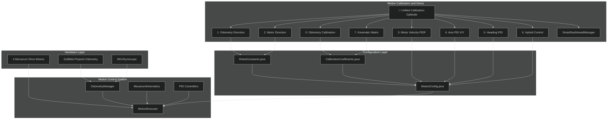

### Coordinate System Reference

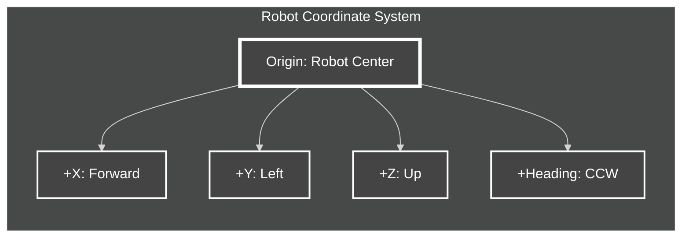

**Coordinate System Details:**
- **Origin:** Geometric center of drivetrain at floor level
- **+X Axis:** Forward (toward scoring mechanism)
- **+Y Axis:** Left (driver's left when facing forward)
- **+Z Axis:** Up (away from floor)
- **+Heading:** Counter-clockwise rotation (0° = facing +X)
- **Units:** Inches for distance, degrees for angles

---

## Calibration Workflow

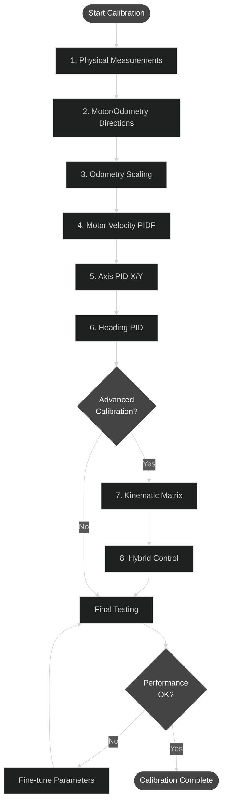

### Calibration Sequence

| Step | Module | Priority | Time | Prerequisites |
|------|--------|----------|------|---------------|
| 0 | **Physical Measurements** | **CRITICAL** | 30 min | Tape measure, calipers |
| 1 | **Odometry Calibration** | **CRITICAL** | 30 min | Step 0 complete |
| 2 | **Odometry Direction** | **CRITICAL** | 15 min | Steps 0-1 complete |
| 3 | **Motor Direction** | **CRITICAL** | 15 min | Steps 0-2 complete |
| 4 | **Motor Velocity PIDF** | **HIGH** | 45 min | Steps 0-3 complete |
| 5 | **Axis PID (X/Y)** | **MEDIUM** | 30 min | Steps 0-4 complete |
| 6 | **Heading PID** | **MEDIUM** | 30 min | Steps 0-4 complete |
| 7 | **Hybrid Control** | OPTIONAL | 30 min | Steps 0-6 complete |
| 8 | **Kinematic Matrix** | OPTIONAL | 60 min | All steps complete |

---

## Pre-Calibration Checklist

Before starting calibration, ensure:

### Hardware
- [ ] All 4 drive motors securely mounted and connected
- [ ] GoBilda Pinpoint odometry computer installed and connected
- [ ] IMU mounted and configured
- [ ] All motor encoders functioning
- [ ] Battery fully charged
- [ ] Robot mechanically sound (no loose parts)

### Software
- [ ] Latest code branch checked out and compiled successfully
- [ ] Driver Station connected to Robot Controller
- [ ] FTC Dashboard accessible at http://192.168.43.1:8080/dash
- [ ] "🎯 Motion Calibration and Demo" OpMode visible in TeleOp
- [ ] All 8 calibration modules load without errors

### Environment  
- [ ] Large open space (minimum 10' x 10')
- [ ] Level surface (field mat recommended)
- [ ] Good lighting for measurements
- [ ] Markers/tape available for position marking
- [ ] Measuring tools ready

### Documentation
- [ ] This calibration guide available
- [ ] Notebook/tablet for recording measurements
- [ ] Access to edit source files

---

## Motion Calibration and Demo Usage

### Getting Started

1. **Launch the Calibration System**
   - Select "🎯 Motion Calibration and Demo" from TeleOp OpModes
   - Press START to initialize the system
   - Connect to FTC Dashboard at http://192.168.43.1:8080/dash

2. **Dashboard Interface**
   - **ModeSelector**: Choose calibration module (dropdown menu)
   - **ENABLE_TESTING**: Toggle to start/stop calibration tests
   - **RESET_TO_DEFAULTS**: Reset current module parameters
   - **Module-specific parameters**: Adjust in real-time

3. **Calibration Workflow**
   ```
   Select Module → Adjust Parameters → Enable Testing → Observe Results → Record Values
   ```

### Key Features

- **Modular Design**: 8 independent calibration modules
- **Real-time Tuning**: Adjust parameters and see immediate results
- **Smart Telemetry**: 3-tier system prevents dashboard overload
- **Dropdown Selection**: No more typing module numbers
- **Performance Metrics**: Automatic calculation of settling time, overshoot, etc.

### Manual Parameter Update Process

**IMPORTANT**: The Motion Calibration and Demo uses **intentional manual workflow** for parameter updates:

1. **Calibrate in Dashboard**: Adjust parameters and test in real-time
2. **Record Optimal Values**: Write down the best-performing parameters
3. **Update Source Files**: Manually edit the appropriate .java files
4. **Rebuild & Deploy**: Compile and deploy updated code to robot
5. **Verify**: Test that changes persist after restart

**Why Manual Updates?**
- ✅ Forces deliberate parameter validation
- ✅ Ensures code review of all changes  
- ✅ Maintains audit trail in version control
- ✅ Eliminates runtime file dependencies
- ✅ More reliable for competition use

---

## Physical Measurements

### Overview

Physical measurements form the foundation of all robot calibration. Accurate measurements here directly impact all subsequent calibration steps.

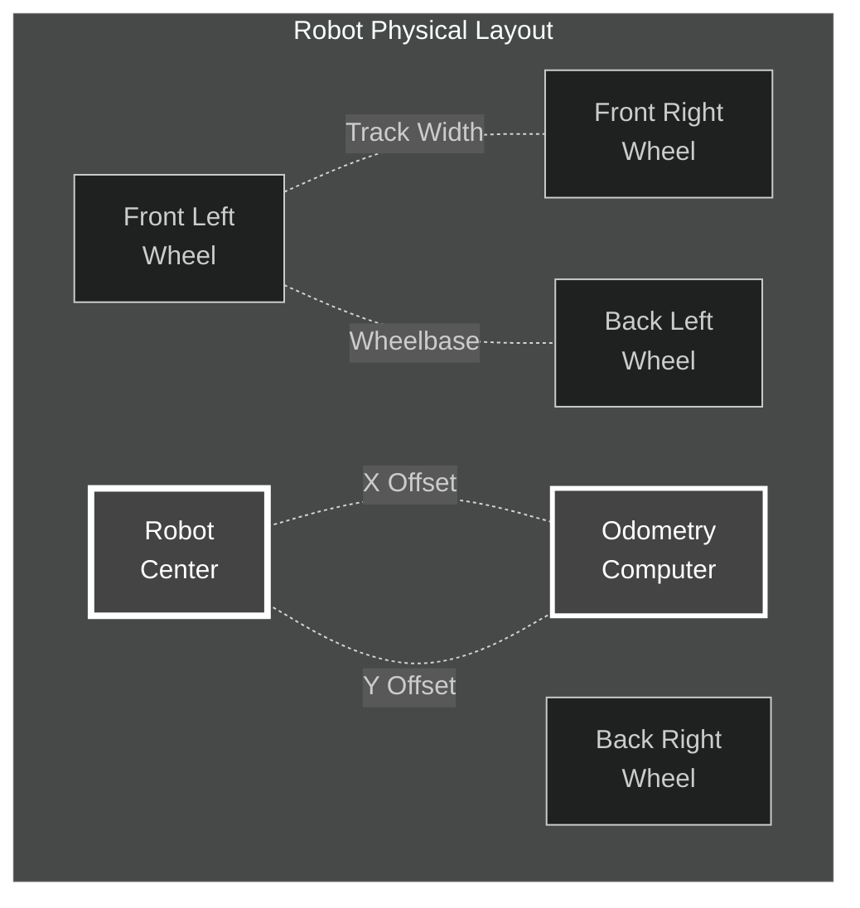

### Measurement Tables

#### 1.1 Robot Dimensions

| Parameter | Description | Current Value | Your Measurement | Units | File to Update |
|-----------|-------------|---------------|------------------|-------|----------------|
| **ROBOT_LENGTH** | Front to back extent | 17.0 | ____________ | inches | RobotConstants.java:241 |
| **ROBOT_WIDTH** | Left to right extent | 14.2 | ____________ | inches | RobotConstants.java:242 |
| **ROBOT_HEIGHT** | Floor to top extent | 15.0 | ____________ | inches | RobotConstants.java:243 |

#### 1.2 Drivetrain Geometry

| Parameter | Description | Current Value | Your Measurement | Units | File to Update |
|-----------|-------------|---------------|------------------|-------|----------------|
| **TRACK_WIDTH** | Center-to-center distance between left/right wheels | 11.97 | ____________ | inches | RobotConstants.java:239 |
| **WHEELBASE** | Center-to-center distance between front/back wheels | 9.45 | ____________ | inches | RobotConstants.java:240 |
| **WHEEL_DIAMETER** | Actual wheel diameter (measure with calipers) | 4.096 | ____________ | inches | RobotConstants.java:215 |
| **GEAR_REDUCTION** | Motor to wheel gear ratio | 1.0 | ____________ | ratio | RobotConstants.java:221 |

**Measurement Tips:**
- **Track Width:** Measure from the center of left wheel contact patch to center of right wheel contact patch
- **Wheelbase:** Measure from the center of front wheel to center of back wheel  
- **Wheel Diameter:** Use calipers for accuracy; measure at multiple points and average
- **Gear Reduction:** Check your motor/gearbox specifications

#### 1.3 Motor Specifications

| Parameter | Description | Current Value | Your Value | Units | File to Update |
|-----------|-------------|---------------|------------|-------|----------------|
| **MOTOR_MAX_RPM_DATASHEET** | Maximum RPM from datasheet | 312.0 | ____________ | RPM | RobotConstants.java:409 |
| **ENCODER_COUNTS_PER_REV** | Encoder ticks per motor revolution | 537.7 | ____________ | counts | RobotConstants.java:414 |

**Find These Values:**
- Check your motor model (e.g., goBILDA 5203 series)
- Look up specifications on goBILDA website or datasheet
- Encoder counts are typically printed on motor or in documentation

#### 1.4 Odometry Computer Position

**CRITICAL:** These offsets must be measured accurately for rotation accuracy!

| Parameter | Description | Current Value | Your Measurement | Units | File to Update |
|-----------|-------------|---------------|------------------|-------|----------------|
| **ODOMETRY_X_OFFSET** | Distance from robot center to odometry (forward/back) | -5.725 | ____________ | inches | RobotConstants.java:269 |
| **ODOMETRY_Y_OFFSET** | Distance from robot center to odometry (left/right) | 1.885 | ____________ | inches | RobotConstants.java:269 |

**How to Measure:**
1. Find the geometric center of your drivetrain (intersection of diagonals between wheels)
2. Measure X distance: Positive = odometry is forward of center, Negative = behind center
3. Measure Y distance: Positive = odometry is left of center, Negative = right of center

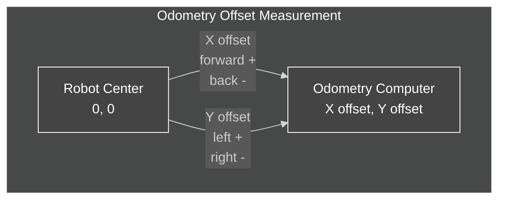

#### 1.5 Sensor and Component Positions

| Component | X Position | Y Position | Z Position | File to Update |
|-----------|------------|------------|------------|----------------|
| **Odometry Sensor** | -4.5 | 8.0 | 0.0 | RobotConstants.java:571-579 |
| **Back Camera** | -8.0 | 0.0 | 8.0 | RobotConstants.java:585 |
| **Front Camera** | +6.0 | 0.0 | 8.0 | RobotConstants.java:593 |
| **IMU** | 0.0 | 0.0 | 4.0 | RobotConstants.java:600 |

**Your Measurements:**

| Component | X (forward+) | Y (left+) | Z (up+) |
|-----------|--------------|-----------|---------|
| Odometry | __________ | __________ | __________ |
| Back Camera | __________ | __________ | __________ |
| Front Camera | __________ | __________ | __________ |
| IMU | __________ | __________ | __________ |

---

## Calibration Modules

This section details each of the 8 calibration modules in the Motion Calibration and Demo. Each module is accessed through the FTC Dashboard dropdown menu and provides real-time parameter tuning.

### Module Access Instructions

1. **Select Module**: Use `ModeSelector → CALIBRATION_MODE` dropdown in FTC Dashboard
2. **Adjust Parameters**: Modify values in the module's @Config section
3. **Test**: Toggle `ENABLE_TESTING` to run calibration tests
4. **Record**: Write down optimal values for manual source file updates

### Module Overview

| Module | Dashboard Name | Purpose | Config Section |
|--------|----------------|---------|----------------|
| 0 | Odometry Calibration | Distance scaling factors | OdometryCalibrationParams |
| 1 | Odometry Direction | Encoder direction verification | _3_OdometryDirection |
| 2 | Motor Direction | Motor/encoder directions | _1_MotorDirection |
| 3 | Motor Velocity PIDF | Velocity control tuning | _2_MotorVelocityPIDF |
| 4 | Axis PID (X/Y) | Position control tuning | _5_DistancePID |
| 5 | Heading PID | Rotation control tuning | _6_HeadingPID |
| 6 | Hybrid Control | Feedforward/feedback blending | _7_HybridControl |
| 7 | Kinematic Matrix | 8-factor velocity scaling | _8_KinematicMatrix |

### 📋 Quick Reference: Where to Update Calibrated Values

After tuning parameters via FTC Dashboard, use this table to know exactly which source files to update:

| Calibration Module | Dashboard @Config Class | Update This File | Key Lines |
|--------------------|------------------------|------------------|-----------|
| **Module 0: Odometry** | `_4_OdometryScale` | CalibrationCoefficients.java | 40, 54, 67 |
| **Module 1: Odometry Direction** | `_3_OdometryDirection` | RobotConstants.java | 520-527 |
| **Module 2: Motor Direction** | `_1_MotorDirection` | RobotConstants.java | 451-458, 470-477 |
| **Module 3: Motor Velocity PIDF** | `_2_MotorVelocityPIDF` | MotionConfig.java | 215-218 |
| **Module 4: Distance PID** | `_5_DistancePID` | MotionConfig.java | 153-155 |
| **Module 5: Heading PID** | `_6_HeadingPID` | MotionConfig.java | 158-160 |
| **Module 6: Hybrid Control** | `_7_HybridControl` | MotionConfig.java | 244 |
| **Module 7: Kinematic Matrix** | `_8_KinematicMatrix` | CalibrationCoefficients.java | 133-148, 182-195 |

**File Locations:**
- **RobotConstants.java**: `TeamCode/src/main/java/org/firstinspires/ftc/teamcode/calibration/RobotConstants.java`
- **CalibrationCoefficients.java**: `TeamCode/src/main/java/org/firstinspires/ftc/teamcode/calibration/CalibrationCoefficients.java`
- **MotionConfig.java**: `TeamCode/src/main/java/org/firstinspires/ftc/teamcode/motion/MotionConfig.java`

---

### Module 0: Odometry Calibration

**Purpose:** Calibrate odometry distance scaling factors to correct systematic errors in position tracking.

**Priority:** CRITICAL  
**Time:** 30 minutes  
**Dashboard Selection:** "Odometry Calibration"

```mermaid
%%{init: {'theme':'dark'}}%%
flowchart LR
    Start([Start]) --> Mark1[Mark Start Position]
    Mark1 --> Command[Command 24 inch Forward]
    Command --> Measure[Measure Actual Distance]
    Measure --> Calc[Calculate Scale Factor]
    Calc --> Update[Update Coefficients]
    Update --> Test[Test Other Directions]
    Test --> Done([Complete])
    
    style Start fill:#444,stroke:#fff,color:#fff
    style Done fill:#444,stroke:#fff,color:#fff
```

#### Procedure

1. **Setup**
   - Select Mode 0 in FTC Dashboard → ModeSelector → CALIBRATION_MODE
   - Place robot in large open area with tape measure
   - Mark starting position clearly

2. **Forward/Backward Calibration**
   ```
   Dashboard → _4_OdometryScale → MOVE_FORWARD = true
   ```
   - Robot moves forward slowly
   - Measure actual distance traveled with tape measure
   - Record in Dashboard → ACTUAL_FORWARD_DISTANCE
   - Repeat for MOVE_BACKWARD_24

3. **Strafe Calibration**
   ```
   Dashboard → _4_OdometryScale → MOVE_LEFT = true
   Dashboard → _4_OdometryScale → MOVE_RIGHT = true
   ```
   - Measure actual left/right distances
   - Record in ACTUAL_LEFT_DISTANCE and ACTUAL_RIGHT_DISTANCE

4. **Calculate Corrections**
   - System auto-calculates:
     - FORWARD_CORRECTION = Actual / Encoder reading
     - BACKWARD_CORRECTION = Actual / Encoder reading
     - STRAFE_CORRECTION = Average of left/right corrections

#### Calibration Values Table

| Movement | Commanded Distance | Encoder Reading | Actual Measured | Scale Factor | Notes |
|----------|-------------------|-----------------|-----------------|--------------|-------|
| Forward | 24.0" | __________ | __________ | __________ | __________ |
| Backward | 24.0" | __________ | __________ | __________ | __________ |
| Left | 18.0" | __________ | __________ | __________ | __________ |
| Right | 18.0" | __________ | __________ | __________ | __________ |

**Scale Factor Calculation:**
```
Scale Factor = Actual Distance / Encoder Distance
```

**Example:**
- Encoder reads 24.0", actual measured is 23.2"
- Scale Factor = 23.2 / 24.0 = 0.9667

#### Update Location

**File:** `TeamCode/src/main/java/org/firstinspires/ftc/teamcode/calibration/CalibrationCoefficients.java`

```java
// Lines 40, 54, 67
public static final double ODOMETRY_X_SCALE = 1.00;      // Update with forward/backward average
public static final double ODOMETRY_Y_SCALE = 1.00;      // Update with strafe average  
public static final double ODOMETRY_HEADING_SCALE = 1.00; // Update after rotation tests
```

---

### Module 1: Odometry Direction Calibration

**Purpose:** Verify and correct odometry encoder directions.

**Priority:** CRITICAL  
**Time:** 15 minutes  
**Dashboard Selection:** "Odometry Direction"

#### Procedure

1. **Setup**
   - Select Mode 1 in FTC Dashboard
   - Enable Dashboard → _3_OdometryDirection → START_TEST = true

2. **Test Each Direction**
   - Robot will move in each cardinal direction
   - Verify odometry readings match physical movement
   - Check signs are correct (forward = +X, left = +Y)

3. **Verify Rotation**
   - Robot rotates counter-clockwise
   - Verify heading increases (positive rotation)

#### Direction Verification Table

| Test | Expected Odometry | Actual Odometry | Correct? | Invert Needed? |
|------|-------------------|-----------------|----------|----------------|
| Forward | +X increases | __________ | ☐ Yes ☐ No | ☐ Yes ☐ No |
| Backward | -X increases | __________ | ☐ Yes ☐ No | ☐ Yes ☐ No |
| Left | +Y increases | __________ | ☐ Yes ☐ No | ☐ Yes ☐ No |
| Right | -Y increases | __________ | ☐ Yes ☐ No | ☐ Yes ☐ No |
| CCW Rotation | Heading + | __________ | ☐ Yes ☐ No | ☐ Yes ☐ No |

#### Update Location

**File:** `TeamCode/src/main/java/org/firstinspires/ftc/teamcode/calibration/RobotConstants.java`

If inversions needed, update encoder direction settings in your odometry configuration.

---

### Module 2: Motor Direction Calibration

**Purpose:** Verify all motor and encoder directions are correct for mecanum drive.

**Priority:** CRITICAL  
**Time:** 15 minutes  
**Dashboard Selection:** "Motor Direction"

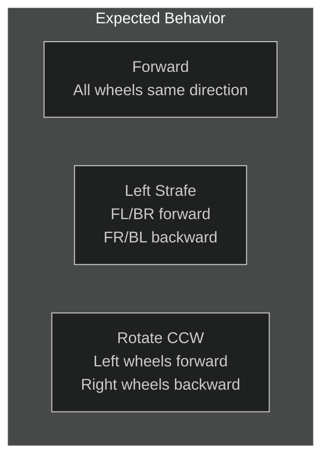

#### Procedure

1. **Setup**
   - Select Mode 2 in FTC Dashboard
   - Place robot with clear view of all wheels

2. **Individual Motor Tests**
   ```
   Dashboard → _1_MotorDirection → TEST_MOTOR = "FRONT_LEFT"
   Dashboard → _1_MotorDirection → RUN_TEST = true
   ```
   - Test each motor: FRONT_LEFT, FRONT_RIGHT, BACK_LEFT, BACK_RIGHT
   - Verify motor spins in expected direction
   - Verify encoder counts increase

3. **Combined Movement Tests**
   - Test forward: All wheels should rotate to move robot forward
   - Test strafe left: FL/BR forward, FR/BL backward
   - Test rotate CCW: Left wheels forward, right wheels backward

#### Motor Direction Table

| Motor | Forward Test | Encoder Count | Correct? | Direction to Set |
|-------|--------------|---------------|----------|------------------|
| Front Left | __________ | Increasing? ☐ | ☐ Yes ☐ No | ☐ FORWARD ☐ REVERSE |
| Front Right | __________ | Increasing? ☐ | ☐ Yes ☐ No | ☐ FORWARD ☐ REVERSE |
| Back Left | __________ | Increasing? ☐ | ☐ Yes ☐ No | ☐ FORWARD ☐ REVERSE |
| Back Right | __________ | Increasing? ☐ | ☐ Yes ☐ No | ☐ FORWARD ☐ REVERSE |

#### Update Location

**File:** `TeamCode/src/main/java/org/firstinspires/ftc/teamcode/calibration/RobotConstants.java`

```java
// Lines 451-458
public static final DcMotorSimple.Direction FRONT_LEFT_MOTOR_DIRECTION = DcMotorSimple.Direction.REVERSE;
public static final DcMotorSimple.Direction FRONT_RIGHT_MOTOR_DIRECTION = DcMotorSimple.Direction.FORWARD;
public static final DcMotorSimple.Direction BACK_LEFT_MOTOR_DIRECTION = DcMotorSimple.Direction.REVERSE;
public static final DcMotorSimple.Direction BACK_RIGHT_MOTOR_DIRECTION = DcMotorSimple.Direction.FORWARD;
```

---

### Module 3: Motor Velocity PIDF Calibration

**Purpose:** Tune PIDF controller for accurate motor velocity control.

**Priority:** HIGH  
**Time:** 45 minutes  
**Dashboard Class:** `_2_MotorVelocityPIDF`

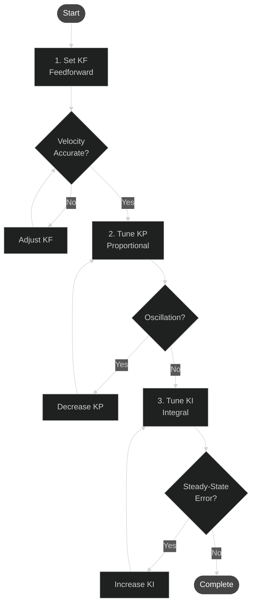

#### Procedure

1. **Setup**
   - Select Mode 3 in FTC Dashboard
   - Start with current values in MotionConfig.java

2. **Tune Feedforward (KF)**
   ```
   Dashboard → _2_MotorVelocityPIDF → MOTOR_KF = 16.8
   Dashboard → _2_MotorVelocityPIDF → TARGET_VELOCITY = 1000
   Dashboard → _2_MotorVelocityPIDF → RUN_TEST = true
   ```
   - Adjust KF until actual velocity closely matches target
   - KF should provide ~90% of required power

3. **Tune Proportional (KP)**
   ```
   Dashboard → _2_MotorVelocityPIDF → MOTOR_KP = 10.0
   ```
   - Increase KP to reduce error
   - If oscillation occurs, decrease KP
   - Target: Quick response without overshoot

4. **Tune Integral (KI)**
   ```
   Dashboard → _2_MotorVelocityPIDF → MOTOR_KI = 3.0
   ```
   - Increase KI to eliminate steady-state error
   - Watch for integral windup
   - Start small, increase gradually

5. **Tune Derivative (KD)** (Usually left at 0)
   ```
   Dashboard → _2_MotorVelocityPIDF → MOTOR_KD = 0.0
   ```
   - Only adjust if needed for damping
   - Can help with overshoot

#### PIDF Tuning Table

| Test Velocity | KF Value | KP Value | KI Value | KD Value | Actual Velocity | Error | Notes |
|---------------|----------|----------|----------|----------|-----------------|-------|-------|
| 500 ticks/s | ______ | ______ | ______ | ______ | ______ | ______ | ______ |
| 1000 ticks/s | ______ | ______ | ______ | ______ | ______ | ______ | ______ |
| 1500 ticks/s | ______ | ______ | ______ | ______ | ______ | ______ | ______ |
| 2000 ticks/s | ______ | ______ | ______ | ______ | ______ | ______ | ______ |

**Final Tuned Values:**
- KF: __________
- KP: __________
- KI: __________
- KD: __________

#### Update Location

**File:** `TeamCode/src/main/java/org/firstinspires/ftc/teamcode/motion/MotionConfig.java`

```java
// Lines 165-168
public static final double MOTOR_VELOCITY_KP = 10.0;  // Your KP value
public static final double MOTOR_VELOCITY_KI = 3.0;   // Your KI value
public static final double MOTOR_VELOCITY_KD = 0.0;   // Your KD value
public static final double MOTOR_VELOCITY_KF = 16.8;  // Your KF value
```

---

### Module 4: Distance-Based PID Calibration Module (2-PID System)

**Purpose:** Tune Distance PID controller for unified linear motion control (X/Y combined).

**Architecture:** 2-PID System - Distance PID controls linear motion, Heading PID controls rotation independently.

**Priority:** MEDIUM  
**Time:** 30 minutes  
**Dashboard Class:** `_5_DistancePID`

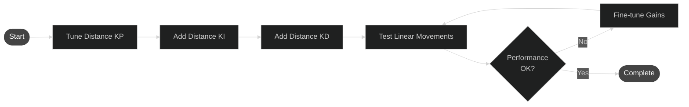

#### Procedure

1. **Setup**
   - Select Mode 4 in FTC Dashboard
   - Mark test positions on field

2. **Distance PID Tuning (Unified Linear Motion)**
   ```
   Dashboard → _5_DistancePID → TARGET_DISTANCE = 24.0
   Dashboard → _5_DistancePID → DISTANCE_KP = 0.08
   Dashboard → _5_DistancePID → RUN_TEST = true
   ```
   - Start with low KP, gradually increase
   - Watch for overshoot and oscillation
   - Add KI if steady-state error persists
   - Add KD for damping if needed

3. **Test Different Directions**
   - Test forward/backward movement
   - Test left/right strafe movement
   - Test diagonal movements
   - All use the same Distance PID gains

#### Distance PID Tuning Table

**Unified Distance PID (All Directions):**

| Target Distance | Direction | KP | KI | KD | Overshoot | Settling Time | Final Error | Notes |
|-----------------|-----------|----|----|----|-----------|--------------| ------------|-------|
| 12" | Forward | ______ | ______ | ______ | ______ | ______ | ______ | ______ |
| 24" | Forward | ______ | ______ | ______ | ______ | ______ | ______ | ______ |
| 48" | Forward | ______ | ______ | ______ | ______ | ______ | ______ | ______ |
| 18" | Strafe Left | ______ | ______ | ______ | ______ | ______ | ______ | ______ |
| 36" | Strafe Right | ______ | ______ | ______ | ______ | ______ | ______ | ______ |
| 24" | Diagonal | ______ | ______ | ______ | ______ | ______ | ______ | ______ |

**Final Distance PID Values (Used for All Directions):**
- KP: __________
- KI: __________
- KD: __________


#### Update Location

**File:** `TeamCode/src/main/java/org/firstinspires/ftc/teamcode/motion/MotionConfig.java`

```java
// Lines 156-161
public static final double POSITION_X_KP = 0.08;   // Your X-axis KP
public static final double POSITION_X_KI = 0.002;  // Your X-axis KI
public static final double POSITION_X_KD = 0.0;    // Your X-axis KD

public static final double POSITION_Y_KP = 0.08;   // Your Y-axis KP
public static final double POSITION_Y_KI = 0.002;  // Your Y-axis KI
public static final double POSITION_Y_KD = 0.0;    // Your Y-axis KD
```

---

### Module 5: Heading PID Calibration (Rotation Control)

**Purpose:** Tune PID controller for accurate heading/rotation control.

**Priority:** MEDIUM  
**Time:** 30 minutes  
**Dashboard Class:** `_6_HeadingPID`

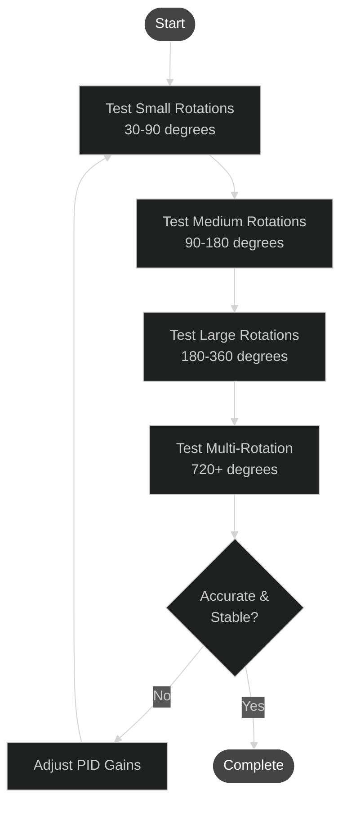

#### Procedure

1. **Setup**
   - Select Mode 5 in FTC Dashboard
   - Mark robot's starting orientation

2. **Tuning Process**
   ```
   Dashboard → _6_HeadingPID → TARGET_HEADING = 90.0
   Dashboard → _6_HeadingPID → HEADING_KP = 0.05
   Dashboard → _6_HeadingPID → RUN_TEST = true
   ```
   - Start with small rotations (30-90°)
   - Increase KP until slight overshoot
   - Add KI to eliminate steady-state error
   - Test larger rotations (180°, 360°, 720°)

3. **Special Considerations**
   - Heading control wraps at ±180°
   - Test both CW and CCW rotations
   - Verify behavior across 0° boundary

#### Heading PID Tuning Table

| Target Heading | KP | KI | KD | Overshoot | Settling Time | Final Error | Notes |
|----------------|----|----|----|-----------|--------------| ------------|-------|
| 30° | ______ | ______ | ______ | ______ | ______ | ______ | ______ |
| 90° | ______ | ______ | ______ | ______ | ______ | ______ | ______ |
| 180° | ______ | ______ | ______ | ______ | ______ | ______ | ______ |
| 360° | ______ | ______ | ______ | ______ | ______ | ______ | ______ |
| -90° | ______ | ______ | ______ | ______ | ______ | ______ | ______ |

**Final Heading Values:**
- KP: __________
- KI: __________
- KD: __________

#### Update Location

**File:** `TeamCode/src/main/java/org/firstinspires/ftc/teamcode/motion/MotionConfig.java`

```java
// Lines 171-173
public static final double HEADING_KP = 0.05;    // Your heading KP
public static final double HEADING_KI = 0.001;   // Your heading KI
public static final double HEADING_KD = 0.0;     // Your heading KD
```

---

### Module 6: Hybrid Control Calibration

**Purpose:** Optimize combined translation and rotation control.

**Priority:** OPTIONAL  
**Time:** 30 minutes  
**Dashboard Class:** `_7_HybridControl`

#### Procedure

1. **Setup**
   - Select Mode 6 in FTC Dashboard
   - Ensure Modules 0-5 are completed

2. **Test Combined Movements**
   ```
   Dashboard → _7_HybridControl → TARGET_X = 24.0
   Dashboard → _7_HybridControl → TARGET_Y = 24.0
   Dashboard → _7_HybridControl → TARGET_HEADING = 90.0
   Dashboard → _7_HybridControl → RUN_TEST = true
   ```
   - Test diagonal movements with rotation
   - Observe coupling between translation and rotation
   - Adjust priority weights if needed

#### Hybrid Movement Tests

| Test Movement | X Target | Y Target | Heading Target | Success? | Time | Final Error | Notes |
|---------------|----------|----------|----------------|----------|------|-------------|-------|
| Forward + CCW | 24" | 0" | 90° | ☐ | ____ | ____ | ____ |
| Diagonal + CCW | 24" | 24" | 90° | ☐ | ____ | ____ | ____ |
| Strafe + CW | 0" | 24" | -90° | ☐ | ____ | ____ | ____ |
| Complex Path | ____ | ____ | ____ | ☐ | ____ | ____ | ____ |

#### Update Location

Hybrid control uses the same PID values from Modules 4 and 5. If adjustments needed:

**File:** `TeamCode/src/main/java/org/firstinspires/ftc/teamcode/motion/MotionConfig.java`

---

### Module 7: Kinematic Matrix Calibration

**Purpose:** Calibrate the 3×4 kinematic matrix for cross-coupling corrections.

**Priority:** OPTIONAL (Advanced)  
**Time:** 60 minutes  
**Dashboard Class:** `_8_KinematicMatrix`

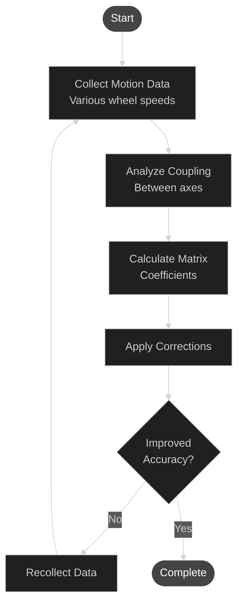

#### Understanding the Kinematic Matrix

The kinematic matrix corrects for real-world deviations from ideal mecanum kinematics:

```
[vx_actual]     [K11  K12  K13  K14] [ωFL]
[vy_actual]  =  [K21  K22  K23  K24] [ωFR]
[ω_actual ]     [K31  K32  K33  K34] [ωBL]
                                     [ωBR]
```

Where:
- vx = forward/backward velocity
- vy = left/right velocity
- ω = rotation rate
- ωFL/FR/BL/BR = individual wheel velocities

#### Procedure

1. **Setup**
   - Select Mode 7 in FTC Dashboard
   - Large open area required

2. **Data Collection**
   ```
   Dashboard → _8_KinematicMatrix → COLLECT_DATA = true
   Dashboard → _8_KinematicMatrix → NUM_TEST_PATTERNS = 20
   ```
   - System automatically tests various wheel speed combinations
   - Records commanded vs. actual motions
   - Collects 20+ data points

3. **Matrix Calculation**
   ```
   Dashboard → _8_KinematicMatrix → CALCULATE_MATRIX = true
   ```
   - System performs least-squares regression
   - Calculates optimal matrix coefficients
   - Displays quality metrics (R², condition number)

4. **Verification**
   ```
   Dashboard → _8_KinematicMatrix → APPLY_CALIBRATION = true
   Dashboard → _8_KinematicMatrix → TEST_CALIBRATION = true
   ```
   - Test various movements with new matrix
   - Compare before/after accuracy

#### Kinematic Matrix Values

**Current Matrix (Ideal):**

|  | FL | FR | BL | BR |
|--|----|----|----|----|
| vx | 0.25 | 0.25 | 0.25 | 0.25 |
| vy | 0.25 | -0.25 | -0.25 | 0.25 |
| ω | calc | -calc | calc | -calc |

**Your Calibrated Matrix:**

|  | FL | FR | BL | BR |
|--|----|----|----|----|
| vx | ______ | ______ | ______ | ______ |
| vy | ______ | ______ | ______ | ______ |
| ω | ______ | ______ | ______ | ______ |

**Calibration Quality Metrics:**
- R² (goodness of fit): __________ (target: > 0.95)
- Condition Number: __________ (target: < 50)
- RMS Residual: __________ inches (target: < 0.5)
- Data Points: __________ (minimum: 20)

#### Update Location

**File:** `TeamCode/src/main/java/org/firstinspires/ftc/teamcode/calibration/CalibrationCoefficients.java`

```java
// Lines 159-178
// Row 1: vx coefficients
public static double KINEMATIC_K11 = 0.25;  // Your FL→vx value
public static double KINEMATIC_K12 = 0.25;  // Your FR→vx value
public static double KINEMATIC_K13 = 0.25;  // Your BL→vx value
public static double KINEMATIC_K14 = 0.25;  // Your BR→vx value

// Row 2: vy coefficients
public static double KINEMATIC_K21 = 0.25;   // Your FL→vy value
public static double KINEMATIC_K22 = -0.25;  // Your FR→vy value
public static double KINEMATIC_K23 = -0.25;  // Your BL→vy value
public static double KINEMATIC_K24 = 0.25;   // Your BR→vy value

// Row 3: ω coefficients
public static double KINEMATIC_K31 = [calc];   // Your FL→ω value
public static double KINEMATIC_K32 = -[calc];  // Your FR→ω value
public static double KINEMATIC_K33 = [calc];   // Your BL→ω value
public static double KINEMATIC_K34 = -[calc];  // Your BR→ω value
```

---

## Value Update Locations

### Quick Reference: Where to Update Calibrated Values

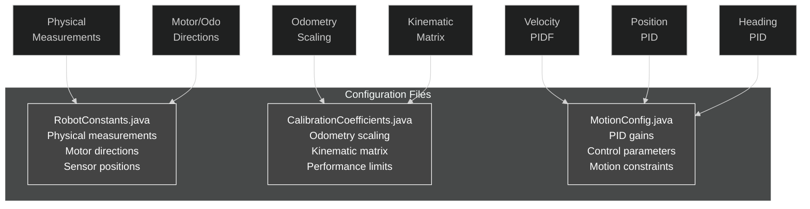

### File Locations Summary

#### RobotConstants.java
**Path:** `TeamCode/src/main/java/org/firstinspires/ftc/teamcode/calibration/RobotConstants.java`

| Line(s) | Parameter | What It Controls |
|---------|-----------|------------------|
| 357 | WHEEL_DIAMETER | Wheel size for odometry calculations |
| 365 | ENCODER_COUNTS_PER_REV | Motor encoder resolution |
| 373 | MOTOR_MAX_RPM_DATASHEET | Maximum motor speed |
| 380 | GEAR_REDUCTION | Drive gear ratio |
| 392 | TRACK_WIDTH | Left-right wheel spacing |
| 399 | WHEELBASE | Front-back wheel spacing |
| 451-458 | Motor Directions | FORWARD/REVERSE for each motor |
| 571 | ODOMETRY_X_OFFSET | Odometry computer X position |
| 579 | ODOMETRY_Y_OFFSET | Odometry computer Y position |
| 585 | BACK_CAMERA_REF | Back camera position |
| 593 | FRONT_CAMERA_REF | Front camera position |
| 600 | IMU_REF | IMU position |
| 634 | ROBOT_LENGTH | Robot front-to-back size |
| 640 | ROBOT_WIDTH | Robot left-to-right size |
| 646 | ROBOT_HEIGHT | Robot floor-to-top size |

#### CalibrationCoefficients.java
**Path:** `TeamCode/src/main/java/org/firstinspires/ftc/teamcode/calibration/CalibrationCoefficients.java`

| Line(s) | Parameter | What It Controls |
|---------|-----------|------------------|
| 40 | ODOMETRY_X_SCALE | Forward/backward distance correction |
| 54 | ODOMETRY_Y_SCALE | Strafe distance correction |
| 67 | ODOMETRY_HEADING_SCALE | Rotation angle correction |
| 88 | CALIBRATED_MAX_LINEAR_VELOCITY | Maximum translation speed |
| 99 | CALIBRATED_MAX_ANGULAR_VELOCITY | Maximum rotation speed |
| 110 | CALIBRATED_MAX_LINEAR_ACCELERATION | Maximum translation acceleration |
| 121 | CALIBRATED_MAX_ANGULAR_ACCELERATION | Maximum rotation acceleration |
| 159-178 | KINEMATIC_K## | Kinematic matrix coefficients (12 values) |
| 183-188 | Kinematic metadata | Calibration quality metrics |

#### MotionConfig.java
**Path:** `TeamCode/src/main/java/org/firstinspires/ftc/teamcode/motion/MotionConfig.java`

| Line(s) | Parameter | What It Controls |
|---------|-----------|------------------|
| 156 | POSITION_X_KP | X-axis proportional gain |
| 157 | POSITION_X_KI | X-axis integral gain |
| 158 | POSITION_X_KD | X-axis derivative gain |
| 159 | POSITION_Y_KP | Y-axis proportional gain |
| 160 | POSITION_Y_KI | Y-axis integral gain |
| 161 | POSITION_Y_KD | Y-axis derivative gain |
| 165 | MOTOR_VELOCITY_KP | Motor velocity proportional gain |
| 166 | MOTOR_VELOCITY_KI | Motor velocity integral gain |
| 167 | MOTOR_VELOCITY_KD | Motor velocity derivative gain |
| 168 | MOTOR_VELOCITY_KF | Motor velocity feedforward gain |
| 171 | HEADING_KP | Heading proportional gain |
| 172 | HEADING_KI | Heading integral gain |
| 173 | HEADING_KD | Heading derivative gain |

---

## Troubleshooting

### Common Issues and Solutions

#### Issue: Robot moves in wrong direction

**Symptoms:**
- Forward command makes robot go backward
- Left strafe makes robot go right
- Rotation goes opposite direction

**Solutions:**
1. Check motor directions in RobotConstants.java (lines 451-458)
2. Verify motor cable connections
3. Run Motor Direction Calibration (Module 2)
4. Check odometry encoder directions (Module 1)

#### Issue: Odometry readings don't match actual movement

**Symptoms:**
- Robot moves 24" but odometry shows 26"
- Strafe distance is consistently off
- Rotation angle is incorrect

**Solutions:**
1. Run Odometry Calibration (Module 0)
2. Update ODOMETRY_X_SCALE, ODOMETRY_Y_SCALE in CalibrationCoefficients.java
3. Verify WHEEL_DIAMETER is accurate (measure with calipers)
4. Check for wheel slippage during movements
5. Verify ODOMETRY_X_OFFSET and ODOMETRY_Y_OFFSET are correct

#### Issue: Robot oscillates around target position

**Symptoms:**
- Robot overshoots and comes back repeatedly
- Never settles at target
- Continuous back-and-forth motion

**Solutions:**
1. **Decrease KP:** Reduce proportional gain
2. **Add/Increase KD:** Add derivative damping
3. **Check for mechanical issues:** Binding, loose parts
4. **Reduce MAX_LINEAR_VELOCITY:** May be moving too fast
5. Check POSITION_DEADBAND isn't too small

#### Issue: Robot doesn't reach target position precisely

**Symptoms:**
- Stops short of target consistently
- Final error always in same direction
- Steady-state error present

**Solutions:**
1. **Increase KI:** Add integral term to eliminate steady-state error
2. **Increase KP:** May not be strong enough
3. **Check MIN_MOTOR_POWER:** May be set too high
4. **Verify odometry scaling:** May be systematically off
5. Check for mechanical friction/binding

#### Issue: Motor velocity control is inaccurate

**Symptoms:**
- Commanded velocity doesn't match actual
- Velocity overshoots or undershoots
- Inconsistent speed

**Solutions:**
1. Tune MOTOR_VELOCITY_KF first (feedforward)
2. Adjust MOTOR_VELOCITY_KP for faster response
3. Add MOTOR_VELOCITY_KI for steady-state accuracy
4. Check battery voltage (low battery affects performance)
5. Verify ENCODER_COUNTS_PER_REV is correct

#### Issue: Robot rotates during straight-line movements

**Symptoms:**
- Robot drifts rotationally when moving forward/backward
- Heading changes during strafe
- Unexpected rotation

**Solutions:**
1. Verify motor directions are correct (Module 2)
2. Check mechanical alignment of wheels
3. Ensure wheels are same diameter
4. Run Kinematic Matrix Calibration (Module 7)
5. Check for uneven motor power
6. Verify IMU is mounted level

#### Issue: Strafe movements go at an angle

**Symptoms:**
- Strafe left/right also moves forward/backward
- Diagonal drift during strafing

**Solutions:**
1. Check mecanum wheel orientation
2. Verify motor directions (especially diagonal pairs)
3. Run Motor Direction Calibration (Module 2)
4. Check wheel condition (worn rollers)
5. Run Kinematic Matrix Calibration for advanced correction

#### Issue: FTC Dashboard not accessible

**Symptoms:**
- Cannot connect to http://192.168.43.1:8080/dash
- Connection timeout
- Dashboard won't load

**Solutions:**
1. Verify Robot Controller WiFi is active
2. Check laptop/tablet is connected to Robot Controller WiFi
3. Try http://192.168.49.1:8080/dash (alternative address)
4. Restart Robot Controller app
5. Check FTC Dashboard library is included in build
6. Verify port 8080 isn't blocked by firewall

#### Issue: Calibration values don't persist

**Symptoms:**
- Changes in Dashboard reset after restart
- Robot behavior reverts to old calibration

**Solutions:**
1. Dashboard values are temporary - must update source files
2. Edit the appropriate .java files with calibrated values
3. Rebuild and deploy code to robot
4. Verify file changes are saved before building
5. Check correct branch is checked out (VortexDecode)

#### Issue: High-speed movements are inaccurate

**Symptoms:**
- Slow movements are accurate, fast movements overshoot
- Position error increases with speed
- Wheels slip at high acceleration

**Solutions:**
1. Reduce MAX_LINEAR_VELOCITY in CalibrationCoefficients.java
2. Reduce MAX_LINEAR_ACCELERATION (prevent wheel slip)
3. Tune velocity PIDF at higher speeds (Module 3)
4. Check for mechanical resonance
5. Verify traction (consider different wheels/surface)

#### Issue: Combined movements (translation + rotation) behave poorly

**Symptoms:**
- Robot handles X, Y, and rotation separately OK
- Combined movements are inaccurate
- Coupling between axes

**Solutions:**
1. Run Hybrid Control Calibration (Module 6)
2. Run Kinematic Matrix Calibration (Module 7)
3. Verify individual axis PIDs are well-tuned first
4. Check mechanical interference between movements
5. Adjust motion priority weights

---

## Best Practices

### Calibration Process Tips

1. **Calibrate in Order**
   - Follow the module sequence (0-7)
   - Each module builds on previous calibrations
   - Don't skip critical modules (0-3)

2. **Test Environment**
   - Calibrate on same surface as competition
   - Fully charged battery for consistent results
   - Clear, level area for movement tests
   - Consistent temperature (motors behave differently when cold/hot)

3. **Measurement Accuracy**
   - Use quality measuring tools
   - Take multiple measurements and average
   - Mark positions clearly with tape
   - Have a helper for more accurate measurements

4. **Incremental Tuning**
   - Make small changes to PID gains
   - Test after each change
   - Document what works and what doesn't
   - Keep a calibration log with dates

5. **Version Control**
   - Commit calibrated values to git
   - Tag successful calibrations
   - Keep backup of working configurations
   - Document calibration conditions in commit messages

### Maintenance and Re-calibration

Re-calibrate when:
- Mechanical changes (wheel replacement, structural modifications)
- After robot damage/repair
- Significant performance degradation
- Moving to different competition surface
- Start of new competition season
- Battery replacement (if different specifications)

Quick checks to perform regularly:
- Odometry scale factors (Module 0) - 15 min
- Motor directions (Module 2) - 5 min
- Velocity PIDF at single test speed - 10 min

### Performance Validation

After calibration, verify performance with:

**Accuracy Tests:**
- [ ] 48" forward movement within 0.5" tolerance
- [ ] 36" strafe movement within 0.5" tolerance
- [ ] 360° rotation within 2° tolerance
- [ ] Diagonal movement (24", 24") within 1" tolerance
- [ ] Complex path following with multiple waypoints

**Repeatability Tests:**
- [ ] Same movement repeated 5 times gives consistent results
- [ ] Standard deviation < 0.3" for position
- [ ] Standard deviation < 1° for heading

**Speed Tests:**
- [ ] Max velocity movements remain accurate
- [ ] Quick direction changes don't cause instability
- [ ] Acceleration/deceleration is smooth

---

## Appendix

### Calibration Record Sheet

**Date:** _______________  
**Robot Name:** _______________  
**Calibrated By:** _______________  
**Battery Voltage:** _______________  
**Surface Type:** _______________

**Modules Completed:**
- [ ] Module 0: Odometry Calibration
- [ ] Module 1: Odometry Direction
- [ ] Module 2: Motor Direction
- [ ] Module 3: Motor Velocity PIDF
- [ ] Module 4: Axis PID (X/Y)
- [ ] Module 5: Heading PID
- [ ] Module 6: Hybrid Control
- [ ] Module 7: Kinematic Matrix

**Final Accuracy Achieved:**
- Position Error: __________ inches
- Heading Error: __________ degrees
- Repeatability: __________ (good/excellent/needs work)

**Notes:**
_________________________________________________________________
_________________________________________________________________
_________________________________________________________________

### Quick Start Checklist

For experienced users who have calibrated before:

**30-Minute Quick Calibration:**
1. [ ] Update physical dimensions (RobotConstants.java)
2. [ ] Verify motor directions (Module 2) - 5 min
3. [ ] Quick odometry test (Module 0) - 10 min
4. [ ] Velocity PIDF spot check (Module 3) - 10 min
5. [ ] Test autonomous routine - 5 min

**Full Calibration (3-4 hours):**
1. [ ] Physical measurements - 30 min
2. [ ] All 8 calibration modules - 180 min
3. [ ] Validation testing - 30 min
4. [ ] Documentation and file updates - 20 min

### References

**FTC Programming Resources:**
- FTC SDK Documentation: https://github.com/FIRST-Tech-Challenge/FtcRobotController
- Game Manual 1: Rules and regulations
- Game Manual 2: Robot and field specifications

**Third-Party Libraries Used:**
- FTC Dashboard: https://acmerobotics.github.io/ftc-dashboard/
- GoBilda Pinpoint Odometry: https://www.gobilda.com/

**Mecanum Drive Theory:**
- Coordinate systems and transformations
- Kinematic equations
- PID control theory

**Support:**
- For issues with this calibration system, check TeamCode comments
- FTC Discord server for general programming help
- Mentor/coach for robot-specific questions

---

## Conclusion

Congratulations on completing the VortexDecode calibration process! With proper calibration, your robot should now:

- ✅ Track position accurately with odometry
- ✅ Move precisely to commanded positions
- ✅ Rotate to accurate headings
- ✅ Execute smooth, controlled motions
- ✅ Perform reliably in autonomous mode

**Remember:**
- Calibration is an iterative process
- Re-calibrate after mechanical changes
- Keep records of your calibration values
- Test thoroughly before competition
- Fine-tune based on real-world performance

**Good luck with your robot!** 🤖🎯

---

*Document Version: 2.0*  
*Last Updated: December 2024*  
*Motion Calibration and Demo*
